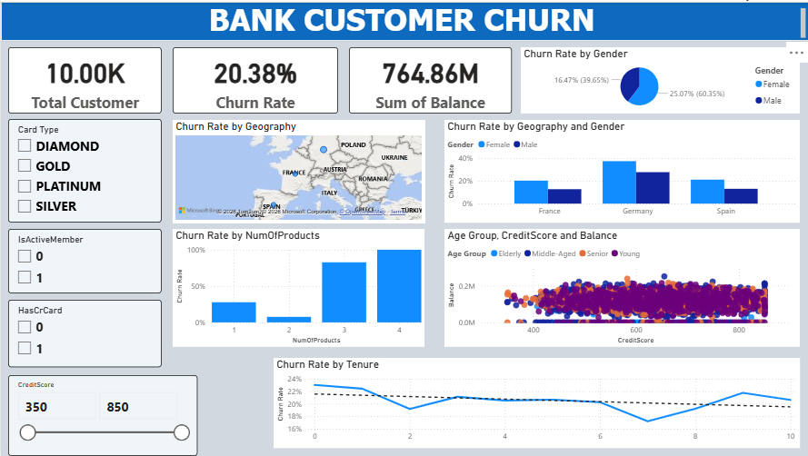

# 📊 Bank Customer Churn Analysis & Retention Strategy

## 📌 1. Project Overview & Business Value
This project focuses on analyzing a retail banking dataset containing **10,000 customers** to solve a critical business problem: a high **20.38% Churn Rate**. By leveraging **Power BI**, the analysis uncovers key behavioral and demographic risk factors (Credit Score, Age, Balance, Geography) to provide data-driven retention strategies, aiming to safeguard a total portfolio of **$764.86M in Balance**.

---

## 🖼️ 2. Dashboard Preview & Interactive Features
*The dashboard features advanced dynamic filtering, cross-highlighting, and interactive drill-down paths from country-level trends to granular customer details.*



---

## 🐍 3. Data Preparation & ETL Workflow (Python / Pandas)
Instead of using Power Query, a rigorous Data Cleansing and Feature Engineering pipeline was built using **Python (Pandas)** to prepare the dataset before importing it into Power BI. 

* **Data Ingestion:** Loaded the raw `Bank Customer Churn` CSV file into a Pandas DataFrame.
* **Deduplication:** Dropped duplicate records strictly based on the `CustomerId` primary key to ensure data unique integrity.
* **Missing & Outlier Handling:** Audited missing values and treated extreme anomalies within `Age` and `Balance` distributions to prevent skewed analytical results.
* **Feature Engineering:** Developed custom categorical bins to segment the customer base for deeper analysis:
  * `Age Group`: Segmented raw age into `Young`, `Middle-Aged`, `Senior`, and `Elderly`.
  * `Balance Category`: Binned financial status into `Low` (<$50K), `Medium` ($50K - $100K), and `High` (>$100K).

👉 *To view the complete step-by-step data preprocessing and feature engineering code, please check out the source file here: **[Jupyter Notebook Link](data_preprocessing/data_preprocessing.ipynb)

---

## 🧪 4. Data Modeling & Advanced DAX Metrics
The analytics engine is powered by optimized DAX formulas to calculate accurate ratios regardless of user-selected filters:

* **Dynamic Churn Rate:**
```dax
  Churn Rate = 
  DIVIDE(
      CALCULATE(COUNT(Bank_Churn[CustomerId]), Bank_Churn[Exited] = 1),
      COUNT(Bank_Churn[CustomerId]),
      0
  )
```

* **Dynamic Churn Rate:**
```Avg CreditScore by Product = AVERAGE(Bank_Churn[CreditScore])```
## 💡 5. In-Depth Analytical Insights

### 🌍 A. Geographic & Demographic Churn Hotspots
* **The Germany Crisis:** Germany is the most volatile region, presenting a staggering **32.44% Churn Rate** - nearly double the rates of France (16.17%) and Spain (16.67%).
* **The Female Segment Bleed:** Female customers exhibit a **26.00% average churn rate** compared to Males at 18.00%. This issue is most acute in Germany, where Female churn reaches **37.55%**, contributing to 28.28% of the bank's total global churn.

### 📦 B. The Cross-Selling & Product Count Paradox
* **The Loyalty Sweet Spot:** Customers utilizing **exactly 2 products** demonstrate the highest retention, with an incredibly low churn rate of **7.60%**.
* **High-Risk Cross-Selling:** Risk escalates drastically for customers holding 3 or more products. Shockingly, the churn rate for customers with **4 products hits an absolute 100.00%**.

### ⏳ C. Customer Lifecycle & Financial Backbone
* **First-Year Onboarding Risk:** New accounts (`Tenure = 0`) present the highest immediate defection rate at **23.00%**. If guided safely past the first year, customer loyalty peaks around Year 7 (17.22% churn).
* **The Revenue Engine:** Scatter plot analysis shows that Young and Middle-Aged segments hold the vast majority of high-balance accounts ($50K - $200K). Safeguarding this cohort is critical to maintaining the bank's liquidity pool.

---

## 🚀 6. Actionable Business Recommendations

> 🎯 **Key Retention Strategies:**
> 
> * **De-risk the German Female Segment:** Deploy specialized focus groups, tailored loyalty benefits, and proactive customer satisfaction surveys specifically targeting female account holders in Germany to uncover and resolve service friction.
> * **Re-engineer Cross-Selling Guidelines:** Shift sales KPIs to incentivize the 2-product combo sweet spot. Audit the pricing, hidden fees, and UX friction points of the 3-4 product bundles to stop alienating high-value clients.
> * **Incentivize Early-Stage Tenure:** Introduce a First-Year VIP Onboarding Program offering fee waivers, cash-back rewards, and automated relationship manager touchpoints during the critical 12-month window (`Tenure = 0`).

##  📂 7. Repository Structure
```
├── data/              # Contains Raw & Cleaned datasets
│   ├── Bank_Customer_Churn.csv
│   └── Bank_Churn_Cleaned.csv
├── data_preprocessing/               # Data Preprocessing Notebook
│   └── data_preprocessing.ipynb
├── dashboard/               # Image of dashboard 
│   └── bank_churn.png
├── powerBI/           # Compiled Power BI report (Bank_churned.pbix)
└── README.md          # Project presentation and executive summary
└── DASHBOARD_GUIDE_VN.md          # Vietnamese Dashboard User Guide
```
